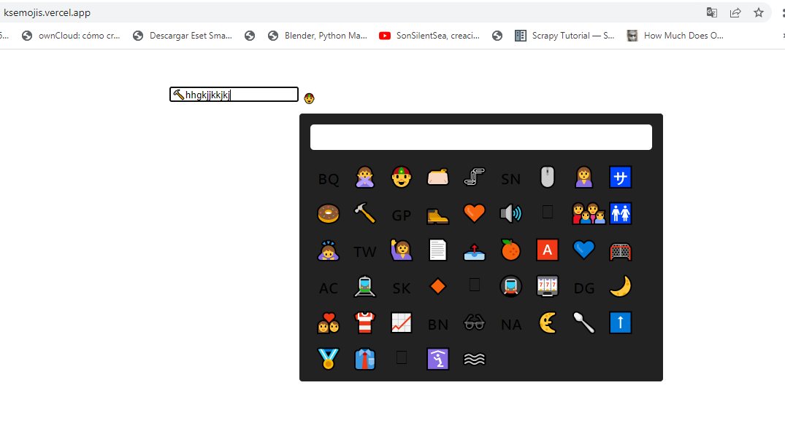

# Kruger Star todoList

>Proyecto de emoji para el uso de hooks de use ref.

## Build with

- JavaScript
- React.js 18
- HTML + CSS
- 

## Live Demo

[live demo link](https://ksemojis.vercel.app/)

## Run it locally

### Setup

- Clone this repo using `https://github.com/Edwin9226/ksemojis.git` 

### Command
- `crear una carpeta react en documentos donde clonaremos nuestro proyecto`
-` dentro de la dirección de la carpeta react ejemplo C:\Users\NombreUsuario\Documents\Kruger\react creada abrimos una linea de comandos CMD `
- `ejecutamos el comando git clone `
- `npm install` 
- `npm start`
- `navegador en la barra pegamos localhost:3000`

## Author

👤 **Edwin Miguel Pinchao Mueses**

- GitHub: [@Edwin9226](https://github.com/Edwin9226)

##  Contributing
- Juan Sotomayor - Tutor Kruger Star.

## Show your support

Give a ⭐ if you like this project!

## Acknowledgments
## 📝 License

This project is [MIT](./MIT.md) licensed.

## Credits enlace de proyectos creador de contenidos

[live de Youtube Creador de contenidos](https://www.youtube.com/watch?v=oT-feDPuJmk)
